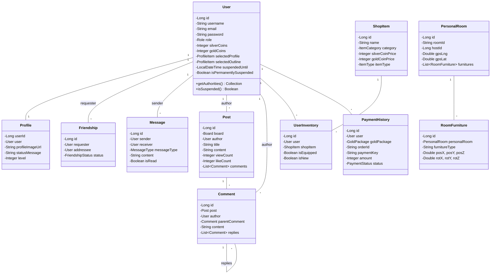
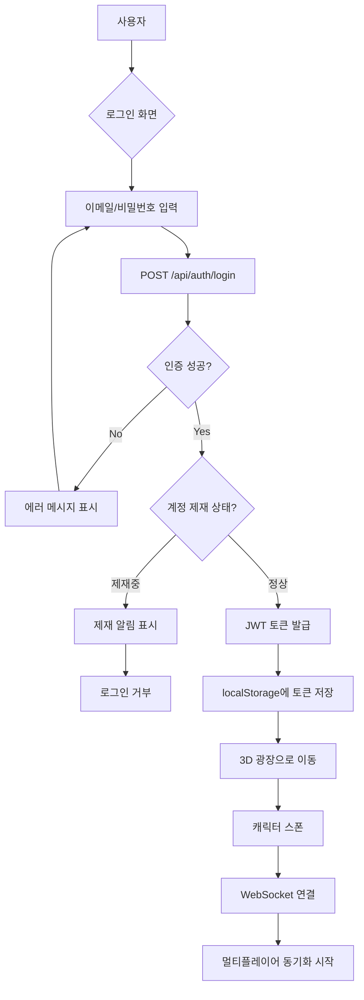
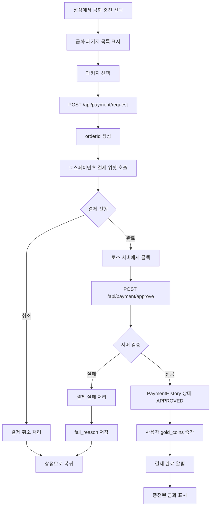
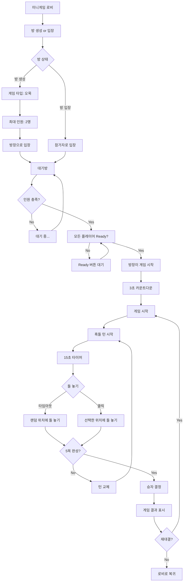
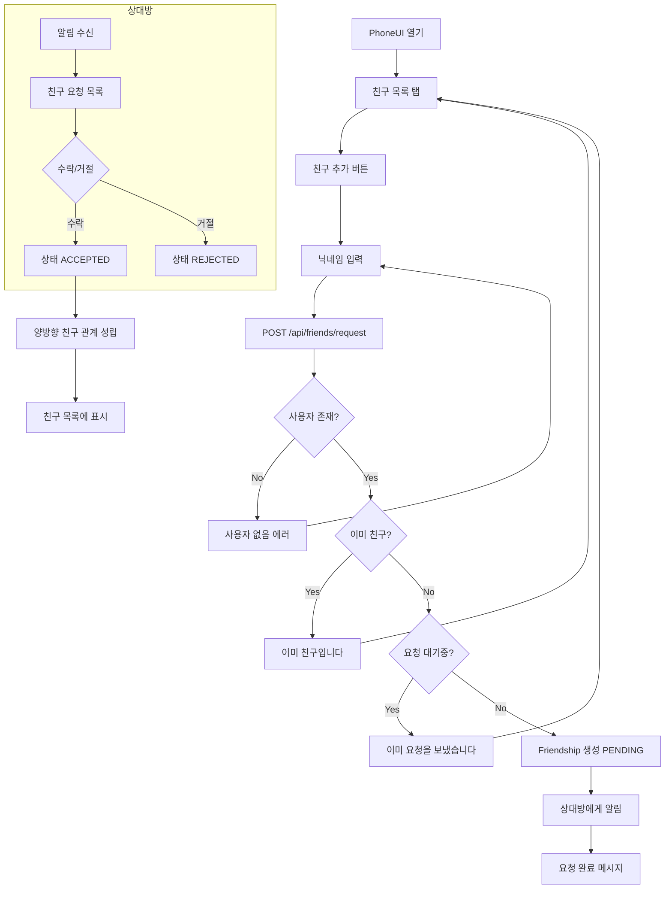
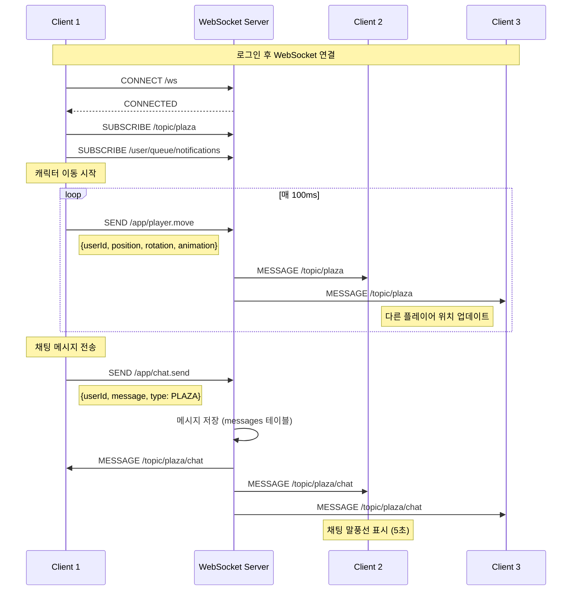
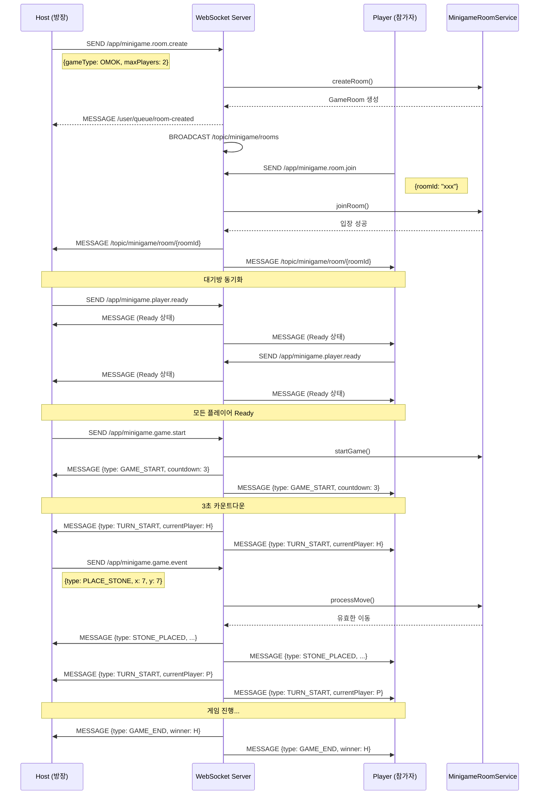
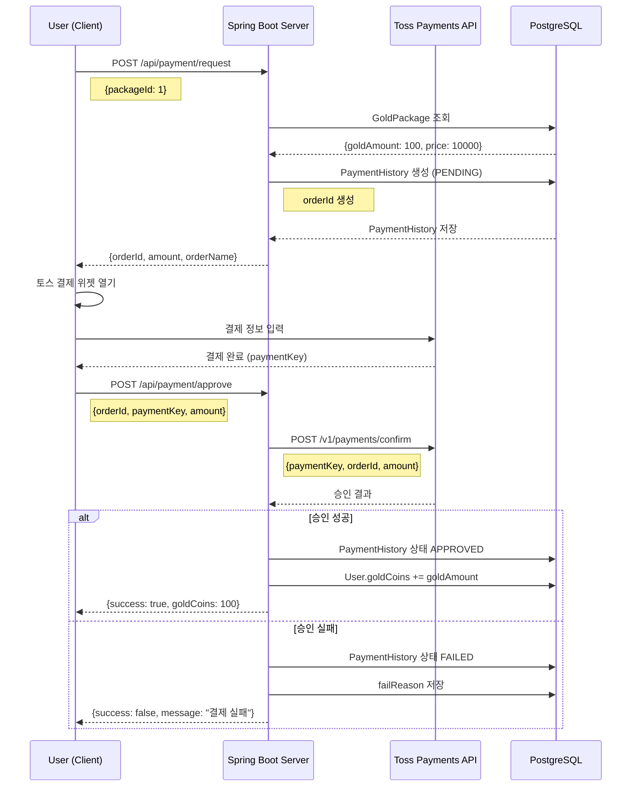

# MetaPlaza 프로젝트 다이어그램

> 이 문서는 **Supabase 실제 데이터베이스**를 기반으로 작성되었습니다.
>
> **작성일**: 2026.01.23
> **기준 브랜치**: backend-new
> **테이블 수**: 26개

---

## 목차

1. [ERD (Entity Relationship Diagram)](#1-erd-entity-relationship-diagram)
2. [시스템 아키텍처](#2-시스템-아키텍처)
3. [클래스 다이어그램](#3-클래스-다이어그램)
4. [플로우차트](#4-플로우차트)
5. [시퀀스 다이어그램](#5-시퀀스-다이어그램)

---

## 1. ERD (Entity Relationship Diagram)

### 1.1 테이블 목록 (26개)

| # | 테이블명 | 행 수 | 설명 |
|---|----------|-------|------|
| 1 | users | 14 | 사용자 계정 |
| 2 | profiles | 3 | 사용자 프로필 |
| 3 | profile_items | 39 | 프로필/외곽선 아이템 |
| 4 | user_profile_items | 125 | 사용자별 해금된 프로필 아이템 |
| 5 | user_sessions | 0 | 사용자 세션 (현재 위치) |
| 6 | friendships | 13 | 친구 관계 |
| 7 | user_blocks | 0 | 차단 목록 |
| 8 | messages | 76 | 채팅 메시지 |
| 9 | chat_rooms | 21 | 채팅방 |
| 10 | chat_participants | 9 | 채팅방 참가자 |
| 11 | boards | 2 | 게시판 |
| 12 | posts | 1 | 게시글 |
| 13 | comments | 3 | 댓글 |
| 14 | likes | 3 | 좋아요 |
| 15 | notices | 0 | 공지사항 |
| 16 | item_categories | 6 | 상점 아이템 카테고리 |
| 17 | shop_items | 78 | 상점 아이템 |
| 18 | user_inventory | 36 | 사용자 인벤토리 |
| 19 | gold_packages | 0 | 금화 패키지 |
| 20 | payment_history | 83 | 결제 내역 |
| 21 | attendance | 177 | 출석 기록 |
| 22 | personal_rooms | 4 | 개인 방 |
| 23 | room_furnitures | 56 | 방 가구 |
| 24 | reports | 0 | 신고 |
| 25 | suspension_history | 0 | 제재 이력 |
| 26 | audit_logs | 0 | 감사 로그 |

### 1.2 전체 ERD (Mermaid)

```mermaid
erDiagram
    users {
        bigint id PK
        varchar username UK
        varchar email UK
        varchar password
        varchar role
        timestamp created_at
        timestamp updated_at
        timestamp suspended_until
        text suspension_reason
        boolean is_permanently_suspended
        timestamp last_login_at
        bigint selected_profile_id FK
        bigint selected_outline_id FK
        integer silver_coins
        integer gold_coins
        integer nickname_changes_remaining
    }

    profiles {
        bigint user_id PK
        varchar profile_image_url
        varchar status_message
        integer level
        integer selected_profile
        integer selected_outline
        timestamp created_at
        timestamp updated_at
    }

    profile_items {
        bigint id PK
        varchar item_type
        varchar item_code UK
        varchar item_name
        varchar image_path
        boolean is_default
        varchar unlock_condition_type
        varchar unlock_condition_value
        integer display_order
        timestamp created_at
    }

    user_profile_items {
        bigint id PK
        bigint user_id FK
        bigint profile_item_id FK
        timestamp unlocked_at
    }

    user_sessions {
        bigint user_id PK
        bigint current_room_id
        varchar current_space_type
        timestamp last_active_at
        timestamp updated_at
    }

    friendships {
        bigint id PK
        bigint requester_id FK
        bigint addressee_id FK
        varchar status
        timestamp created_at
        timestamp updated_at
    }

    user_blocks {
        bigint id PK
        bigint blocker_id FK
        bigint blocked_id FK
        varchar block_type
        timestamp created_at
    }

    chat_rooms {
        bigint id PK
        varchar title
        varchar type
        text last_message
        timestamp created_at
        timestamp updated_at
    }

    chat_participants {
        bigint id PK
        bigint room_id FK
        bigint user_id FK
        bigint last_read_message_id
        timestamp joined_at
    }

    messages {
        bigint id PK
        bigint sender_id FK
        bigint receiver_id FK
        bigint chat_room_id FK
        varchar message_type
        bigint room_id
        text content
        text emoticon
        boolean is_deleted
        boolean is_read
        timestamp read_at
        timestamp created_at
    }

    boards {
        bigint id PK
        varchar name UK
        text description
        varchar category
        boolean is_active
        integer order_index
        bigint post_count
        timestamp created_at
    }

    posts {
        bigint id PK
        bigint board_id FK
        bigint author_id FK
        varchar title
        text content
        text images
        integer view_count
        integer like_count
        varchar post_type
        boolean is_deleted
        timestamp created_at
        timestamp updated_at
    }

    comments {
        bigint id PK
        bigint post_id FK
        bigint author_id FK
        bigint parent_comment_id FK
        text content
        integer like_count
        boolean is_deleted
        timestamp created_at
        timestamp updated_at
    }

    likes {
        bigint id PK
        bigint user_id FK
        varchar target_type
        bigint target_id
        timestamp created_at
    }

    notices {
        bigint id PK
        bigint author_id FK
        varchar title
        text content
        integer view_count
        integer priority
        boolean is_pinned
        boolean is_deleted
        timestamp created_at
        timestamp updated_at
    }

    item_categories {
        bigint id PK
        varchar name UK
        text description
        integer display_order
        boolean is_active
        timestamp created_at
        timestamp updated_at
    }

    shop_items {
        bigint id PK
        varchar name UK
        text description
        bigint category_id FK
        integer price
        integer silver_coin_price
        integer gold_coin_price
        varchar image_url
        varchar model_url
        varchar item_type
        boolean is_active
        timestamp created_at
        timestamp updated_at
    }

    user_inventory {
        bigint id PK
        bigint user_id FK
        bigint shop_item_id FK
        timestamp purchased_at
        boolean is_equipped
        boolean is_new
        timestamp viewed_at
    }

    gold_packages {
        bigint id PK
        varchar name
        text description
        integer gold_amount
        integer price
        integer bonus_gold
        varchar image_url
        boolean is_active
        boolean is_popular
        integer display_order
        timestamp created_at
        timestamp updated_at
    }

    payment_history {
        bigint id PK
        bigint user_id FK
        bigint gold_package_id FK
        varchar order_id UK
        varchar payment_key
        integer amount
        integer gold_amount
        varchar status
        varchar payment_method
        varchar card_company
        varchar card_number
        text fail_reason
        timestamp created_at
        timestamp approved_at
        timestamp canceled_at
    }

    personal_rooms {
        bigint id PK
        varchar room_id UK
        varchar room_name
        bigint host_id UK
        varchar host_name
        integer max_members
        boolean is_private
        float8 gps_lng
        float8 gps_lat
        boolean is_active
        timestamp created_at
        timestamp updated_at
    }

    room_furnitures {
        bigint id PK
        bigint personal_room_id FK
        varchar furniture_id
        varchar furniture_type
        varchar model_path
        float8 pos_x
        float8 pos_y
        float8 pos_z
        float8 rot_x
        float8 rot_y
        float8 rot_z
        float8 scale_x
        float8 scale_y
        float8 scale_z
        boolean is_visible
        varchar color
        text custom_data
        timestamp created_at
        timestamp updated_at
    }

    reports {
        bigint id PK
        varchar report_type
        bigint target_id
        varchar target_title
        bigint reporter_id FK
        bigint target_user_id FK
        varchar reason
        varchar description
        varchar status
        bigint admin_id FK
        varchar admin_note
        timestamp created_at
        timestamp processed_at
    }

    suspension_history {
        bigint id PK
        bigint user_id FK
        bigint admin_id FK
        varchar suspension_type "TEMPORARY, PERMANENT, UNSUSPEND"
        timestamp suspended_until
        text reason
        varchar admin_ip
        timestamp created_at
    }

    audit_logs {
        bigint id PK
        bigint admin_id FK
        varchar action
        varchar target_type
        bigint target_id
        text description
        varchar ip_address
        timestamp created_at
    }

    attendance {
        bigint id PK
        bigint user_id FK
        varchar event_type
        date attendance_date
        integer day_number
        boolean reward_claimed
        integer silver_coins_rewarded
        integer gold_coins_rewarded
        timestamp created_at
    }

    %% ========== 관계 정의 ==========
    users ||--o| profiles : "has"
    users ||--o| user_sessions : "session"
    users ||--o{ user_profile_items : "unlocked"
    users ||--o{ friendships : "requester"
    users ||--o{ friendships : "addressee"
    users ||--o{ user_blocks : "blocker"
    users ||--o{ chat_participants : "participates"
    users ||--o{ messages : "sender"
    users ||--o{ messages : "receiver"
    users ||--o{ posts : "author"
    users ||--o{ comments : "author"
    users ||--o{ likes : "user"
    users ||--o{ notices : "author"
    users ||--o{ user_inventory : "owns"
    users ||--o{ payment_history : "pays"
    users ||--o{ reports : "reporter"
    users ||--o{ suspension_history : "suspended"
    users ||--o{ audit_logs : "admin"
    users ||--o{ attendance : "attends"
    users }o--o| profile_items : "selected_profile"
    users }o--o| profile_items : "selected_outline"

    profile_items ||--o{ user_profile_items : "unlocked_by"

    chat_rooms ||--o{ chat_participants : "has"
    chat_rooms ||--o{ messages : "contains"

    boards ||--o{ posts : "contains"
    posts ||--o{ comments : "has"
    comments ||--o{ comments : "replies"

    item_categories ||--o{ shop_items : "categorizes"
    shop_items ||--o{ user_inventory : "purchased"

    gold_packages ||--o{ payment_history : "package"

    personal_rooms ||--o{ room_furnitures : "contains"
```



### 1.3 도메인별 ERD

#### 사용자 도메인 (5개 테이블)

```
┌─────────────────────────────────────────────────────────────┐
│                          users (14행)                        │
├─────────────────────────────────────────────────────────────┤
│ id (PK)                    │ bigint                         │
│ username (UK)              │ varchar(20) - 닉네임           │
│ email (UK)                 │ varchar                        │
│ password                   │ varchar - BCrypt 암호화        │
│ role                       │ varchar(ROLE_USER/DEVELOPER)   │
│ silver_coins               │ integer - 기본 1000            │
│ gold_coins                 │ integer - 기본 0               │
│ nickname_changes_remaining │ integer - 기본 1               │
│ selected_profile_id (FK)   │ bigint → profile_items         │
│ selected_outline_id (FK)   │ bigint → profile_items         │
│ suspended_until            │ timestamp                      │
│ suspension_reason          │ text                           │
│ is_permanently_suspended   │ boolean                        │
│ last_login_at              │ timestamp                      │
│ created_at                 │ timestamp                      │
│ updated_at                 │ timestamp                      │
└──────────────────────────────┬──────────────────────────────┘
                               │
          ┌────────────────────┼────────────────────┐
          │ 1:1                │ 1:1                │ 1:N
          ▼                    ▼                    ▼
┌─────────────────┐  ┌─────────────────┐  ┌─────────────────────┐
│ profiles (3행)  │  │user_sessions(0)│  │user_profile_items   │
├─────────────────┤  ├─────────────────┤  │      (125행)        │
│ user_id (PK,FK) │  │ user_id (PK,FK)│  ├─────────────────────┤
│ profile_image   │  │ current_room_id│  │ id (PK)             │
│ status_message  │  │ current_space  │  │ user_id (FK)        │
│ level           │  │   _type        │  │ profile_item_id(FK) │
│ selected_profile│  │ last_active_at │  │ unlocked_at         │
│ selected_outline│  │ updated_at     │  └─────────────────────┘
│ created_at      │  └─────────────────┘            │
│ updated_at      │                                 │
└─────────────────┘                                 │
                                                    │ N:1
                                                    ▼
                                    ┌─────────────────────────┐
                                    │  profile_items (39행)   │
                                    ├─────────────────────────┤
                                    │ id (PK)                 │
                                    │ item_type (PROFILE/     │
                                    │           OUTLINE)      │
                                    │ item_code (UK)          │
                                    │ item_name               │
                                    │ image_path              │
                                    │ is_default              │
                                    │ unlock_condition_type   │
                                    │ unlock_condition_value  │
                                    │ display_order           │
                                    │ created_at              │
                                    └─────────────────────────┘
```

#### 소셜/채팅 도메인 (5개 테이블)

```
┌─────────────────────────────────────────────────────────────┐
│                    friendships (13행)                        │
├─────────────────────────────────────────────────────────────┤
│ id (PK)                    │ bigint                         │
│ requester_id (FK)          │ bigint → users                 │
│ addressee_id (FK)          │ bigint → users                 │
│ status                     │ varchar(PENDING/ACCEPTED/      │
│                            │         REJECTED/BLOCKED)      │
│ created_at                 │ timestamp                      │
│ updated_at                 │ timestamp                      │
├─────────────────────────────────────────────────────────────┤
│ UNIQUE(requester_id, addressee_id)                          │
└─────────────────────────────────────────────────────────────┘

┌─────────────────────────────────────────────────────────────┐
│                    user_blocks (0행)                         │
├─────────────────────────────────────────────────────────────┤
│ id (PK)                    │ bigint                         │
│ blocker_id (FK)            │ bigint → users                 │
│ blocked_id (FK)            │ bigint → users                 │
│ block_type                 │ varchar(BLOCK/MUTE)            │
│ created_at                 │ timestamp                      │
└─────────────────────────────────────────────────────────────┘

┌─────────────────────────┐       ┌─────────────────────────┐
│   chat_rooms (21행)     │       │ chat_participants (9행) │
├─────────────────────────┤       ├─────────────────────────┤
│ id (PK)                 │──1:N─→│ id (PK)                 │
│ title                   │       │ room_id (FK)            │
│ type (DM/GROUP)         │       │ user_id (FK)            │
│ last_message            │       │ last_read_message_id    │
│ created_at              │       │ joined_at               │
│ updated_at              │       └─────────────────────────┘
└───────────┬─────────────┘
            │
            │ 1:N
            ▼
┌─────────────────────────────────────────────────────────────┐
│                      messages (76행)                         │
├─────────────────────────────────────────────────────────────┤
│ id (PK)                    │ bigint                         │
│ sender_id (FK)             │ bigint → users                 │
│ receiver_id (FK)           │ bigint → users (nullable)      │
│ chat_room_id (FK)          │ bigint → chat_rooms (nullable) │
│ message_type               │ varchar(PLAZA/LOCAL_ROOM/      │
│                            │         DM/CHAT_ROOM)          │
│ room_id                    │ bigint                         │
│ content                    │ text                           │
│ emoticon                   │ text (JSON)                    │
│ is_deleted                 │ boolean - 기본 false           │
│ is_read                    │ boolean - 기본 false           │
│ read_at                    │ timestamp                      │
│ created_at                 │ timestamp                      │
└─────────────────────────────────────────────────────────────┘
```

#### 게시판 도메인 (5개 테이블)

```
┌─────────────────────────┐       ┌─────────────────────────┐
│    boards (2행)         │       │      posts (1행)        │
├─────────────────────────┤       ├─────────────────────────┤
│ id (PK)                 │──1:N─→│ id (PK)                 │
│ name (UK)               │       │ board_id (FK)           │
│ description             │       │ author_id (FK) → users  │
│ category                │       │ title                   │
│ is_active               │       │ content                 │
│ order_index             │       │ images (JSON)           │
│ post_count              │       │ view_count              │
│ created_at              │       │ like_count              │
└─────────────────────────┘       │ post_type               │
                                  │ is_deleted              │
                                  │ created_at              │
                                  │ updated_at              │
                                  └───────────┬─────────────┘
                                              │ 1:N
                                              ▼
                                  ┌─────────────────────────┐
                                  │    comments (3행)       │
                                  ├─────────────────────────┤
                                  │ id (PK)                 │
                                  │ post_id (FK)            │
                                  │ author_id (FK) → users  │
                                  │ parent_comment_id (FK)  │
                                  │ content                 │
                                  │ like_count              │
                                  │ is_deleted              │
                                  │ created_at              │
                                  │ updated_at              │
                                  └─────────────────────────┘

┌─────────────────────────┐       ┌─────────────────────────┐
│     likes (3행)         │       │    notices (0행)        │
├─────────────────────────┤       ├─────────────────────────┤
│ id (PK)                 │       │ id (PK)                 │
│ user_id (FK) → users    │       │ author_id (FK) → users  │
│ target_type             │       │ title                   │
│ target_id               │       │ content                 │
│ created_at              │       │ view_count              │
└─────────────────────────┘       │ priority                │
                                  │ is_pinned               │
                                  │ is_deleted              │
                                  │ created_at              │
                                  │ updated_at              │
                                  └─────────────────────────┘
```

#### 상점/경제 도메인 (3개 테이블)

```
┌─────────────────────────┐       ┌─────────────────────────┐
│ item_categories (6행)   │       │    shop_items (78행)    │
├─────────────────────────┤       ├─────────────────────────┤
│ id (PK)                 │──1:N─→│ id (PK)                 │
│ name (UK)               │       │ name (UK)               │
│ description             │       │ category_id (FK)        │
│ display_order           │       │ description             │
│ is_active               │       │ price                   │
│ created_at              │       │ silver_coin_price       │
│ updated_at              │       │ gold_coin_price         │
└─────────────────────────┘       │ image_url               │
                                  │ model_url               │
                                  │ item_type               │
                                  │ is_active               │
                                  │ created_at              │
                                  │ updated_at              │
                                  └───────────┬─────────────┘
                                              │ 1:N
                                              ▼
┌─────────────────────────────────────────────────────────────┐
│                   user_inventory (36행)                      │
├─────────────────────────────────────────────────────────────┤
│ id (PK)                    │ bigint                         │
│ user_id (FK)               │ bigint → users                 │
│ shop_item_id (FK)          │ bigint → shop_items            │
│ purchased_at               │ timestamp                      │
│ is_equipped                │ boolean - 기본 false           │
│ is_new                     │ boolean - 기본 true            │
│ viewed_at                  │ timestamp                      │
└─────────────────────────────────────────────────────────────┘
```

#### 결제 도메인 (2개 테이블)

```
┌─────────────────────────┐       ┌─────────────────────────┐
│  gold_packages (0행)    │       │ payment_history (83행)  │
├─────────────────────────┤       ├─────────────────────────┤
│ id (PK)                 │──1:N─→│ id (PK)                 │
│ name                    │       │ user_id (FK) → users    │
│ description             │       │ gold_package_id (FK)    │
│ gold_amount             │       │ order_id (UK)           │
│ price (원화)            │       │ payment_key             │
│ bonus_gold              │       │ amount                  │
│ image_url               │       │ gold_amount             │
│ is_active               │       │ status                  │
│ is_popular              │       │ payment_method          │
│ display_order           │       │ card_company            │
│ created_at              │       │ card_number (마스킹)    │
│ updated_at              │       │ fail_reason             │
└─────────────────────────┘       │ created_at              │
                                  │ approved_at             │
                                  │ canceled_at             │
                                  └─────────────────────────┘

PaymentStatus: PENDING → APPROVED / FAILED / CANCELED
```

#### 개인 공간 도메인 (2개 테이블)

```
┌─────────────────────────┐       ┌─────────────────────────┐
│ personal_rooms (4행)    │       │ room_furnitures (56행)  │
├─────────────────────────┤       ├─────────────────────────┤
│ id (PK)                 │──1:N─→│ id (PK)                 │
│ room_id (UK)            │       │ personal_room_id (FK)   │
│ room_name               │       │ furniture_id            │
│ host_id (UK) → users    │       │ furniture_type          │
│ host_name               │       │ model_path              │
│ max_members (기본 10)   │       │ pos_x, pos_y, pos_z     │
│ is_private              │       │ rot_x, rot_y, rot_z     │
│ gps_lng                 │       │ scale_x, scale_y,       │
│ gps_lat                 │       │   scale_z               │
│ is_active               │       │ is_visible              │
│ created_at              │       │ color                   │
│ updated_at              │       │ custom_data (JSON)      │
└─────────────────────────┘       │ created_at              │
                                  │ updated_at              │
                                  └─────────────────────────┘
```

#### 관리/로그 도메인 (4개 테이블)

```
┌─────────────────────────┐  ┌─────────────────────────┐
│     reports (0행)       │  │suspension_history (0행) │
├─────────────────────────┤  ├─────────────────────────┤
│ id (PK)                 │  │ id (PK)                 │
│ report_type             │  │ user_id (FK) → users    │
│ target_id               │  │ admin_id (FK) → users   │
│ target_title            │  │ suspension_type         │
│ reporter_id (FK)        │  │ suspended_until         │
│ target_user_id (FK)     │  │ reason                  │
│ reason                  │  │ admin_ip                │
│ description             │  │ created_at              │
│ status                  │  └─────────────────────────┘
│ admin_id (FK)           │
│ admin_note              │  ┌─────────────────────────┐
│ created_at              │  │   audit_logs (0행)      │
│ processed_at            │  ├─────────────────────────┤
└─────────────────────────┘  │ id (PK)                 │
                             │ admin_id (FK) → users   │
┌─────────────────────────┐  │ action                  │
│   attendance (177행)    │  │ target_type             │
├─────────────────────────┤  │ target_id               │
│ id (PK)                 │  │ description             │
│ user_id (FK) → users    │  │ ip_address              │
│ event_type              │  │ created_at              │
│ attendance_date         │  └─────────────────────────┘
│ day_number              │
│ reward_claimed          │
│ silver_coins_rewarded   │
│ gold_coins_rewarded     │
│ created_at              │
└─────────────────────────┘
```

---

## 2. 시스템 아키텍처

### 2.1 전체 시스템 아키텍처

```
┌─────────────────────────────────────────────────────────────────────────────┐
│                              CLIENT LAYER                                    │
├─────────────────────────────────────────────────────────────────────────────┤
│                                                                             │
│   ┌─────────────┐    ┌─────────────┐    ┌─────────────┐    ┌─────────────┐ │
│   │   Browser   │    │  React 19   │    │  Three.js   │    │ Mapbox GL   │ │
│   │   (Chrome)  │───→│    SPA      │───→│   + R3F     │    │    JS       │ │
│   └─────────────┘    │  + Router   │    │  + Rapier   │    └─────────────┘ │
│                      └──────┬──────┘    └──────┬──────┘                     │
│                             │                  │                            │
│                             ▼                  ▼                            │
│                      ┌─────────────────────────────────┐                    │
│                      │      State Management           │                    │
│                      │   (useState, useContext)        │                    │
│                      └──────────────┬──────────────────┘                    │
│                                     │                                       │
└─────────────────────────────────────┼───────────────────────────────────────┘
                                      │
                    ┌─────────────────┴─────────────────┐
                    │                                   │
                    ▼                                   ▼
            ┌───────────────┐                   ┌───────────────┐
            │   REST API    │                   │   WebSocket   │
            │  (Axios)      │                   │   (STOMP)     │
            │  Port: 8080   │                   │   /ws         │
            └───────┬───────┘                   └───────┬───────┘
                    │                                   │
┌───────────────────┼───────────────────────────────────┼─────────────────────┐
│                   │         SERVER LAYER              │                     │
├───────────────────┼───────────────────────────────────┼─────────────────────┤
│                   ▼                                   ▼                     │
│   ┌─────────────────────────────────────────────────────────────────────┐   │
│   │                    Spring Boot 3.2.0 (Java 17)                      │   │
│   ├─────────────────────────────────────────────────────────────────────┤   │
│   │                                                                     │   │
│   │   ┌─────────────────┐    ┌─────────────────┐                       │   │
│   │   │ Spring Security │    │  JWT Provider   │                       │   │
│   │   │ + CORS Config   │───→│  (JJWT 0.12.3)  │                       │   │
│   │   └─────────────────┘    └─────────────────┘                       │   │
│   │                                                                     │   │
│   │   ┌─────────────────────────────────────────────────────────────┐   │   │
│   │   │                    Controller Layer                          │   │   │
│   │   ├─────────────────────────────────────────────────────────────┤   │   │
│   │   │ AuthController      │ BoardController    │ ShopController   │   │   │
│   │   │ UserController      │ PostController     │ PaymentController│   │   │
│   │   │ FriendController    │ CommentController  │ AdminController  │   │   │
│   │   │ MessageController   │ LikeController     │ ReportController │   │   │
│   │   │ ProfileController   │ AttendanceController                  │   │   │
│   │   │ PersonalRoomController │ MinigameController (WebSocket)     │   │   │
│   │   │ ChatWebSocketController │ MultiplayerController             │   │   │
│   │   └─────────────────────────────────────────────────────────────┘   │   │
│   │                                    │                                │   │
│   │                                    ▼                                │   │
│   │   ┌─────────────────────────────────────────────────────────────┐   │   │
│   │   │                     Service Layer                            │   │   │
│   │   ├─────────────────────────────────────────────────────────────┤   │   │
│   │   │ AuthService         │ BoardService      │ ShopService       │   │   │
│   │   │ FriendService       │ PostService       │ PaymentService    │   │   │
│   │   │ MessageService      │ CommentService    │ AdminService      │   │   │
│   │   │ CurrencyService     │ LikeService       │ ReportService     │   │   │
│   │   │ PersonalRoomService │ AttendanceService │ StatisticsService │   │   │
│   │   │ MinigameRoomService │ ActiveUserService │ AuditLogService   │   │   │
│   │   └─────────────────────────────────────────────────────────────┘   │   │
│   │                                    │                                │   │
│   │                                    ▼                                │   │
│   │   ┌─────────────────────────────────────────────────────────────┐   │   │
│   │   │                   Repository Layer (JPA)                     │   │   │
│   │   └─────────────────────────────────────────────────────────────┘   │   │
│   │                                                                     │   │
│   └─────────────────────────────────────────────────────────────────────┘   │
│                                        │                                    │
└────────────────────────────────────────┼────────────────────────────────────┘
                                         │
┌────────────────────────────────────────┼────────────────────────────────────┐
│                                        │       DATA LAYER                   │
├────────────────────────────────────────┼────────────────────────────────────┤
│                                        ▼                                    │
│                          ┌─────────────────────────┐                        │
│                          │   PostgreSQL (Supabase) │                        │
│                          │   - 26 Tables           │                        │
│                          │   - Transaction Pooler  │                        │
│                          └─────────────────────────┘                        │
│                                                                             │
└─────────────────────────────────────────────────────────────────────────────┘

┌─────────────────────────────────────────────────────────────────────────────┐
│                            EXTERNAL SERVICES                                 │
├─────────────────────────────────────────────────────────────────────────────┤
│                                                                             │
│   ┌─────────────────┐    ┌─────────────────┐    ┌─────────────────┐        │
│   │   Mapbox API    │    │ Toss Payments   │    │  한국어기초사전  │        │
│   │   (Map Tiles)   │    │   (결제 승인)   │    │   Open API      │        │
│   └─────────────────┘    └─────────────────┘    └─────────────────┘        │
│                                                                             │
└─────────────────────────────────────────────────────────────────────────────┘
```

### 2.2 프론트엔드 아키텍처

```
src/
├── features/                    # Feature-based Architecture
│   ├── auth/
│   │   ├── components/
│   │   │   └── LandingPage.jsx
│   │   ├── services/
│   │   │   └── authService.js
│   │   └── index.js
│   │
│   ├── board/
│   │   ├── components/
│   │   │   ├── BoardModal.jsx
│   │   │   └── BoardDetail.jsx
│   │   ├── services/
│   │   │   └── boardService.js
│   │   └── index.js
│   │
│   ├── profile/
│   │   ├── components/
│   │   │   ├── ProfileModal.jsx
│   │   │   └── ProfileCustomizer.jsx
│   │   └── index.js
│   │
│   ├── shop/
│   │   ├── components/
│   │   │   └── ShopModal.jsx
│   │   └── index.js
│   │
│   ├── inventory/
│   │   ├── components/
│   │   │   └── InventoryModal.jsx
│   │   └── index.js
│   │
│   ├── payment/
│   │   ├── components/
│   │   │   ├── GoldChargeModal.jsx
│   │   │   ├── PaymentCheckout.jsx
│   │   │   └── PaymentCallback.jsx
│   │   └── index.js
│   │
│   ├── minigame/
│   │   ├── components/
│   │   │   ├── MinigameModal.jsx      # 로비
│   │   │   ├── OmokGame.jsx           # 오목
│   │   │   ├── WordChainGame.jsx      # 끝말잇기
│   │   │   ├── LiarGame.jsx           # 라이어 게임
│   │   │   ├── TwentyQuestionsGame.jsx
│   │   │   └── AimingGame.jsx
│   │   └── index.js
│   │
│   └── map/
│       ├── components/
│       │   └── Mapbox3D.jsx
│       └── index.js
│
├── components/                  # Shared Components
│   ├── character/
│   │   ├── Character.jsx        # 플레이어 캐릭터
│   │   ├── OtherPlayer.jsx      # 다른 플레이어
│   │   └── ChatBubble.jsx       # 채팅 말풍선
│   │
│   ├── camera/
│   │   ├── CameraController.jsx
│   │   └── CameraLogger.jsx
│   │
│   ├── phone/
│   │   ├── PhoneUI.jsx          # 휴대폰 UI
│   │   ├── FriendList.jsx
│   │   ├── ChatList.jsx
│   │   └── ChatRoom.jsx
│   │
│   └── ui/
│       ├── GlobalChat.jsx
│       ├── CurrencyDisplay.jsx
│       ├── Notification.jsx
│       └── ContextMenu.jsx
│
├── services/
│   └── multiplayerService.js    # WebSocket/STOMP
│
├── pages/
│   └── admin/
│       ├── AdminLayout.jsx
│       └── Dashboard.jsx
│
├── App.js                       # Main 3D Scene
└── AppRouter.jsx               # React Router
```

### 2.3 백엔드 아키텍처

```
backend/src/main/java/com/community/
├── config/
│   ├── SecurityConfig.java      # Spring Security + JWT
│   ├── WebSocketConfig.java     # STOMP 설정
│   ├── CorsConfig.java          # CORS 설정
│   └── DataInitializer.java     # 초기 데이터
│
├── security/
│   ├── JwtTokenProvider.java    # JWT 생성/검증
│   └── JwtAuthenticationFilter.java
│
├── controller/                  # 24개 Controller
│   ├── AuthController.java      # /api/auth/*
│   ├── ProfileController.java   # /api/profiles/*
│   ├── FriendController.java    # /api/friends/*
│   ├── MessageController.java   # /api/messages/*
│   ├── BoardController.java     # /api/boards/*
│   ├── PostController.java      # /api/posts/*
│   ├── CommentController.java   # /api/comments/*
│   ├── LikeController.java      # /api/likes/*
│   ├── ShopController.java      # /api/shop/*
│   ├── CurrencyController.java  # /api/currency/*
│   ├── PaymentController.java   # /api/payment/*
│   ├── PersonalRoomController.java  # /api/rooms/*
│   ├── AttendanceController.java    # /api/attendance/*
│   ├── ReportController.java    # /api/reports/*
│   ├── AdminController.java     # /api/admin/*
│   ├── MinigameController.java  # WebSocket 미니게임
│   ├── ChatWebSocketController.java
│   └── MultiplayerController.java
│
├── service/                     # 23개 Service
│   ├── AuthService.java
│   ├── FriendService.java
│   ├── MessageService.java
│   ├── BoardService.java
│   ├── PostService.java
│   ├── CommentService.java
│   ├── LikeService.java
│   ├── ShopService.java
│   ├── CurrencyService.java
│   ├── PaymentService.java
│   ├── PersonalRoomService.java
│   ├── AttendanceService.java
│   ├── ReportService.java
│   ├── AdminService.java
│   ├── StatisticsService.java
│   ├── AuditLogService.java
│   ├── MinigameRoomService.java
│   ├── ActiveUserService.java
│   └── ChatService.java
│
├── repository/                  # JPA Repository
│   └── (각 엔티티별 Repository)
│
├── model/                       # 26개 Entity
│   ├── User.java                # users 테이블
│   ├── Profile.java             # profiles 테이블
│   ├── ProfileItem.java         # profile_items 테이블
│   ├── UserProfileItem.java     # user_profile_items 테이블
│   ├── UserSession.java         # user_sessions 테이블
│   ├── Friendship.java          # friendships 테이블
│   ├── UserBlock.java           # user_blocks 테이블
│   ├── ChatRoom.java            # chat_rooms 테이블
│   ├── ChatParticipant.java     # chat_participants 테이블
│   ├── Message.java             # messages 테이블
│   ├── Board.java               # boards 테이블
│   ├── Post.java                # posts 테이블
│   ├── Comment.java             # comments 테이블
│   ├── Like.java                # likes 테이블
│   ├── Notice.java              # notices 테이블
│   ├── ItemCategory.java        # item_categories 테이블
│   ├── ShopItem.java            # shop_items 테이블
│   ├── UserInventory.java       # user_inventory 테이블
│   ├── GoldPackage.java         # gold_packages 테이블
│   ├── PaymentHistory.java      # payment_history 테이블
│   ├── Attendance.java          # attendance 테이블
│   ├── PersonalRoom.java        # personal_rooms 테이블
│   ├── RoomFurniture.java       # room_furnitures 테이블
│   ├── Report.java              # reports 테이블
│   ├── SuspensionHistory.java   # suspension_history 테이블
│   ├── AuditLog.java            # audit_logs 테이블
│   └── (Enum 클래스들)
│
└── dto/                         # DTO 클래스들
```

---

## 3. 클래스 다이어그램

### 3.1 Controller - Service 관계

```mermaid
classDiagram
    class AuthController {
        -AuthService authService
        +register(RegisterRequest) ResponseEntity
        +login(LoginRequest) ResponseEntity
        +checkUsername(String) ResponseEntity
    }

    class AuthService {
        -UserRepository userRepository
        -PasswordEncoder passwordEncoder
        -JwtTokenProvider jwtProvider
        +register(RegisterDto) User
        +authenticate(String, String) String
    }

    class FriendController {
        -FriendService friendService
        +sendRequest(String) ResponseEntity
        +getReceivedRequests() ResponseEntity
        +acceptRequest(Long) ResponseEntity
        +rejectRequest(Long) ResponseEntity
        +getFriends() ResponseEntity
        +deleteFriend(Long) ResponseEntity
    }

    class FriendService {
        -FriendshipRepository friendshipRepo
        -UserRepository userRepository
        +sendFriendRequest(Long, String) Friendship
        +acceptFriendRequest(Long, Long) Friendship
        +getFriends(Long) List~FriendDto~
    }

    class ShopController {
        -ShopService shopService
        +getCategories() ResponseEntity
        +getItems() ResponseEntity
        +purchaseItem(Long) ResponseEntity
        +getInventory() ResponseEntity
        +equipItem(Long) ResponseEntity
    }

    class ShopService {
        -ShopItemRepository shopItemRepo
        -UserInventoryRepository inventoryRepo
        -CurrencyService currencyService
        +getItems(Long) List~ShopItemDto~
        +purchaseItem(Long, Long, String) UserInventory
        +equipItem(Long, Long) UserInventory
    }

    class PaymentController {
        -PaymentService paymentService
        +getPackages() ResponseEntity
        +requestPayment(PaymentRequest) ResponseEntity
        +approvePayment(ApproveRequest) ResponseEntity
    }

    class PaymentService {
        -PaymentHistoryRepository paymentRepo
        -GoldPackageRepository packageRepo
        -CurrencyService currencyService
        +createPaymentRequest(Long, Long) PaymentHistory
        +approvePayment(String, String, Integer) PaymentHistory
    }

    class AdminController {
        -AdminService adminService
        -AuditLogService auditLogService
        +getDashboardStats() ResponseEntity
        +getUsers(Pageable) ResponseEntity
        +suspendUser(Long, SuspendRequest) ResponseEntity
        +getChatLogs() ResponseEntity
        +deleteSession(Long) ResponseEntity
    }

    class AdminService {
        -UserRepository userRepository
        -SuspensionHistoryRepository suspensionRepo
        -StatisticsService statisticsService
        +getDashboardStats() DashboardStatsDto
        +suspendUser(Long, Long, SuspendDto) User
        +getUsers(Pageable, String) Page~UserDto~
    }

    class MinigameController {
        -MinigameRoomService roomService
        -SimpMessagingTemplate messagingTemplate
        +createRoom(CreateRoomMessage) void
        +joinRoom(JoinRoomMessage) void
        +leaveRoom(LeaveRoomMessage) void
        +startGame(StartGameMessage) void
        +handleGameEvent(GameEventMessage) void
    }

    class MinigameRoomService {
        -Map rooms
        -Map userRoomMap
        +createRoom(RoomDto) GameRoom
        +joinRoom(String, Long) GameRoom
        +leaveRoom(String, Long) void
        +startGame(String) void
    }

    AuthController --> AuthService
    FriendController --> FriendService
    ShopController --> ShopService
    PaymentController --> PaymentService
    AdminController --> AdminService
    MinigameController --> MinigameRoomService
```



### 3.2 Entity 클래스 다이어그램



---

## 4. 플로우차트

### 4.1 로그인 플로우



### 4.2 결제 플로우



### 4.3 미니게임 (오목) 플로우



### 4.4 친구 추가 플로우



### 4.5 아이템 구매 플로우

```mermaid
flowchart TD
    A[상점 열기] --> B[카테고리 선택]
    B --> C[아이템 목록 조회]
    C --> D[아이템 선택]
    D --> E[구매 버튼 클릭]

    E --> F{가격 유형}
    F -->|은화| G[은화 잔액 확인]
    F -->|금화| H[금화 잔액 확인]
    F -->|둘 다| I[결제 수단 선택]

    G --> J{잔액 충분?}
    H --> J
    I --> J

    J -->|No| K[잔액 부족 알림]
    K --> L{충전하시겠습니까?}
    L -->|Yes| M[금화 충전 모달]
    L -->|No| A

    J -->|Yes| N[POST /api/shop/items/{id}/purchase]
    N --> O[재화 차감]
    O --> P[UserInventory 생성]
    P --> Q{자동 착용?}

    Q -->|Yes| R[기존 아이템 해제]
    R --> S[새 아이템 착용]
    S --> T[캐릭터 모델 업데이트]

    Q -->|No| U[인벤토리에 추가]

    T --> V[구매 완료 알림]
    U --> V
    V --> W[상점 유지 or 닫기]
```

---

## 5. 시퀀스 다이어그램

### 5.1 실시간 멀티플레이어 동기화



### 5.2 미니게임 방 생성 및 게임 진행



### 5.3 토스페이먼츠 결제 시퀀스



---

## 부록: Enum 정의

### Role
```java
public enum Role {
    ROLE_USER,      // 일반 사용자
    ROLE_DEVELOPER  // 관리자
}
```

### FriendshipStatus
```java
public enum FriendshipStatus {
    PENDING,   // 요청 대기
    ACCEPTED,  // 수락됨
    REJECTED,  // 거절됨
    BLOCKED    // 차단됨
}
```

### MessageType
```java
public enum MessageType {
    PLAZA,      // 광장 채팅
    LOCAL_ROOM, // 로컬 룸 채팅
    DM,         // 1:1 메시지
    CHAT_ROOM   // 채팅방
}
```

### PaymentStatus
```java
public enum PaymentStatus {
    PENDING,   // 결제 대기
    APPROVED,  // 승인 완료
    FAILED,    // 결제 실패
    CANCELED   // 취소됨
}
```

### ReportType
```java
public enum ReportType {
    POST,    // 게시글 신고
    COMMENT, // 댓글 신고
    USER     // 사용자 신고
}
```

### ReportStatus
```java
public enum ReportStatus {
    PENDING,  // 대기 중
    ACCEPTED, // 승인 (조치 완료)
    REJECTED  // 반려 (문제 없음)
}
```

### SuspensionType
```java
public enum SuspensionType {
    TEMPORARY,  // 일시 정지
    PERMANENT,  // 영구 정지
    UNSUSPEND   // 정지 해제
}
```

### ShopItem.ItemType
```java
public enum ItemType {
    ACCESSORY,       // 악세서리
    CLOTHING,        // 의류
    HAIR,            // 헤어
    AVATAR,          // 아바타
    OUTLINE,         // 테두리
    NICKNAME_TICKET, // 닉네임 변경권
    OTHER            // 기타
}
```

### Board.BoardCategory
```java
public enum BoardCategory {
    FREE,       // 자유 게시판
    NOTICE,     // 공지사항
    STRATEGY,   // 공략 게시판
    SUGGESTION  // 건의 게시판
}
```

---

**파일 위치**: `docs/프로젝트_다이어그램.md`
**최종 수정**: 2026.01.23
